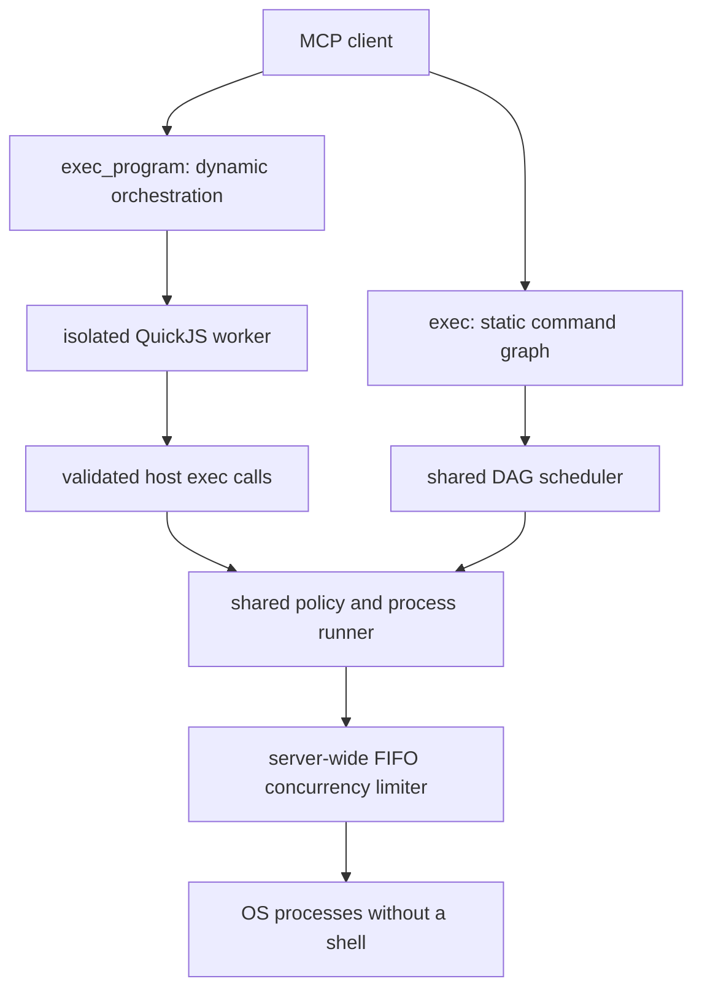

# os-exec-mcp

A local-first Model Context Protocol server for command graphs and sandboxed
programmatic orchestration.

The default MCP surface has two tools:

- `exec` runs independent commands and dependency DAGs through one scheduler.
- `exec_program` runs data-dependent orchestration in isolated QuickJS and exposes
  only four guest APIs: `exec`, `parallel`, `lines`, and `finish`.

Both tools use the same server-owned command policy, path checks, process runner,
timeouts, output bounds, cancellation, and global concurrency limiter. Shell command
strings are never accepted.



## Why this reduces model calls

`exec` submits an entire known graph in one MCP request. The server, rather than the
model, waits for dependencies and starts newly ready steps. A format →
lint/typecheck/test/build workflow therefore needs one model-to-tool round trip.

`exec_program` covers graphs that cannot be fully known in advance. Guest code can
read one command's bounded result, calculate later argv values, filter data, and run
the next operations without returning intermediate output to the model. Only the
value passed to `finish(value)` crosses back to the client.

This does not reduce the number of OS processes requested by the task. It reduces MCP
round trips, model resumptions, repeated context serialization, and unnecessary
intermediate output sent to the model.

## Quick start

Requirements:

- Node.js 20.19 or newer
- npm
- an MCP client with local stdio support

Register the server in Codex:

```bash
codex mcp add os-exec -- npx -y os-exec-mcp
```

There is one startup mode. By default every executable found on the inherited PATH is
allowed except direct privilege-elevation tools such as `sudo`, `su`, `doas`,
`pkexec`, and `runas`. Command authorization is otherwise delegated to the MCP client
and its approval or sandbox model.

Install and verify from source:

```bash
git clone https://github.com/kimata1007/os-exec-mcp.git
cd os-exec-mcp
npm ci
npm run check
```

Build output is written to `dist/`. Start the stdio server directly with:

```bash
OS_EXEC_WORKSPACE_ROOT="$PWD" node dist/mcp/stdio.js
```

MCP JSON-RPC uses stdin/stdout. Redacted JSON logs use stderr only.

## `exec`

Use `exec` for independent work, a dependency DAG, or a mixture of both.

```json
{
  "steps": [
    {
      "id": "format",
      "argv": ["npm", "run", "format"]
    },
    {
      "id": "lint",
      "argv": ["npm", "run", "lint"],
      "depends_on": ["format"]
    },
    {
      "id": "typecheck",
      "argv": ["npm", "run", "typecheck"],
      "depends_on": ["format"]
    },
    {
      "id": "test",
      "argv": ["npm", "test"],
      "depends_on": ["format"]
    }
  ],
  "concurrency": 3,
  "failure_mode": "continue",
  "output": {
    "mode": "compact",
    "max_total_bytes": 65536,
    "max_stream_bytes": 16384,
    "capture": "head_tail",
    "strip_ansi": true
  }
}
```

Each step supports:

- `id`: a unique safe identifier.
- `argv`: a non-empty argv array. `argv[0]` must be a simple executable name.
- `depends_on`: direct predecessor IDs. Omit it for immediately-ready work.
- `cwd`: an existing directory inside a configured workspace root.
- `timeout_ms`: a per-process timeout within the server maximum.
- `env`: only explicitly allowed, non-sensitive environment keys.

The entire graph is validated before execution. Duplicate IDs, unknown dependencies,
self-dependencies, duplicate edges, and cycles reject the request without starting a
process. Successful dependencies unlock their children. In `continue` mode, a failed
branch skips only its descendants; unrelated branches continue. In `fail_fast` mode,
the first observed non-success stops new work and cancels in-flight processes.

Results preserve input order. Status values are `success`, `failed`, `timeout`,
`cancelled`, `skipped`, `rejected`, and `spawn_error`. The summary reports requested
and observed concurrency, including the server-wide peak.

### Output budgeting

Output has a request-wide budget rather than an unlimited per-command response. The
effective per-stream cap is deterministic:

```text
min(requested max_stream_bytes, floor(max_total_bytes / (step_count * 2)))
```

Stdout and stderr pipes continue to drain after the retained limit. `head_tail` keeps
the beginning and end with a deterministic omission marker; `head` keeps only the
prefix. ANSI sequences and carriage returns are stripped by default.

`compact` omits empty/default result fields. `debug` returns all process metadata.
The server also enforces an absolute serialized-response limit.

When `persistTruncatedOutput` is enabled by the server administrator, truncated
streams include an opaque `stdout_resource` or `stderr_resource` URI. The resource is
not listed, contains no filesystem path, is byte-bounded, and expires after the
configured TTL. Persistence is disabled by default.

## `exec_program`

Use `exec_program` only when later control flow or argv values depend on earlier
command output and cannot be expressed as a static DAG.

```json
{
  "source": "const found = await exec(['rg', '--files']);\nconst files = lines(found).filter((name) => name.endsWith('.ts'));\nconst checks = await parallel(files.map((name) => () => exec(['wc', '-l', name])), 4);\nfinish({ files: files.length, lines: checks.map((item) => item.stdout) });",
  "allowed_executables": ["rg", "wc"],
  "cwd": ".",
  "limits": {
    "max_exec_calls": 32,
    "max_concurrency": 4,
    "timeout_ms": 10000,
    "memory_bytes": 67108864,
    "max_return_bytes": 65536
  }
}
```

Guest APIs:

- `await exec(argv, options?)` runs one validated command. Options may contain `cwd`
  and `timeout_ms` only.
- `await parallel(operations, concurrency?)` runs argv arrays or async operation
  functions with bounded ordering-preserving concurrency.
- `lines(value)` splits a string or an exec result's `stdout` into lines.
- `finish(value)` selects the only JSON value returned to the MCP client. It must be
  called exactly once.

`allowed_executables` narrows authority for that program; it never expands the server
policy. Every guest call consumes the call budget, validates argv again, passes the
normal command/path policy, waits for both program-local and server-global execution
slots, and uses the shared process runner.

### Program isolation

Each program gets a new QuickJS runtime inside a separate Node Worker:

- no Node globals, `process`, `Buffer`, `require`, environment, filesystem, network,
  timers, or module loader are exposed;
- QuickJS has a hard memory limit and interrupt deadline;
- the Worker has Node resource limits and can be terminated from outside the VM;
- cancellation and wall timeout terminate the Worker and abort child process trees;
- guest errors and returned values are size-bounded;
- command results contain no resolved executable path or server environment.

QuickJS is a capability sandbox for orchestration code. The OS commands it invokes
are constrained by the existing server policy; they are not magically converted into
pure or read-only operations.

## Global concurrency

Request-local concurrency alone is insufficient when several MCP requests arrive at
once. Every process spawn therefore acquires a permit from one shared FIFO limiter.
Validation and policy preparation happen before the global slot is consumed. Queued
work is removable on cancellation, and shutdown rejects waiters before process-tree
cleanup.

`exec`, `exec_program`, and the optional legacy adapters all share this limiter in the
stdio server.

## Legacy tools

`batch_exec` and `workflow_exec` remain as thin adapters over `ExecExecutor`; they no
longer have independent schedulers. They are hidden by default. Set the
server-administrator environment variable below during migration:

```bash
OS_EXEC_LEGACY_TOOLS=true
```

New clients should use `exec.steps` for both independent batches and DAGs.

## Policy

Set `OS_EXEC_POLICY_FILE` to a strict JSON policy. Unknown fields, malformed values,
missing roots, unavailable executable directories, and inconsistent default/absolute
limits fail startup closed.

```json
{
  "workspaceRoots": ["."],
  "maxBatchSize": 16,
  "maxConcurrency": 16,
  "defaultConcurrency": 8,
  "defaultTimeoutMs": 120000,
  "maxTimeoutMs": 300000,
  "defaultMaxOutputBytes": 262144,
  "absoluteMaxOutputBytes": 1048576,
  "defaultMaxTotalOutputBytes": 262144,
  "absoluteMaxTotalOutputBytes": 1048576,
  "absoluteMaxSerializedResponseBytes": 2097152,
  "defaultOutputMode": "compact",
  "persistTruncatedOutput": false,
  "persistedOutputTtlMs": 300000,
  "persistedOutputMaxBytes": 4194304,
  "defaultProgramMaxExecCalls": 32,
  "absoluteProgramMaxExecCalls": 256,
  "defaultProgramTimeoutMs": 120000,
  "absoluteProgramTimeoutMs": 300000,
  "defaultProgramMemoryBytes": 67108864,
  "absoluteProgramMemoryBytes": 268435456,
  "defaultProgramMaxReturnBytes": 65536,
  "absoluteProgramMaxReturnBytes": 1048576,
  "allowedEnvironmentKeys": [],
  "inheritExecutablePath": true,
  "commandMode": "denylist",
  "deniedCommands": ["doas", "pkexec", "runas", "su", "sudo"],
  "commands": {},
  "logLevel": "info",
  "readOnly": false
}
```

Omitted fields receive these schema defaults. `examples/policy.default.json` mirrors
the built-in policy. `OS_EXEC_POLICY_FILE` remains available for administrators that
need a narrower custom policy; it does not select another startup mode.

Environment overrides:

| Variable                 | Meaning                                            |
| ------------------------ | -------------------------------------------------- |
| `OS_EXEC_POLICY_FILE`    | strict policy JSON path                            |
| `OS_EXEC_WORKSPACE_ROOT` | replace configured roots with one startup root     |
| `OS_EXEC_LOG_LEVEL`      | `debug`, `info`, `warn`, `error`, or `silent`      |
| `OS_EXEC_LEGACY_TOOLS`   | expose `batch_exec` and `workflow_exec` during 0.x |

The former `OS_BATCH_*` names remain migration aliases where applicable. Conflicting
new and legacy values fail startup.

## Security model

- Processes use `spawn` with `shell: false`, ignored stdin, hidden windows, and argv
  arrays.
- Executables resolve through canonical trusted directories or an explicit absolute
  policy path.
- Built-in rules always deny direct privilege-elevation tools. Shells and other
  executables are allowed by the default policy.
- Workspace paths are canonicalized and must remain under configured roots after
  symlink resolution.
- The child environment is minimal. Loader, shell, proxy, credential, `PATH`, and
  common secret variables cannot be supplied by tool callers.
- Timeouts, cancellation, fail-fast, and shutdown terminate process trees.
- Logs exclude argv values, environment maps, and output bodies.

The default command policy is intentionally not a security boundary against a
malicious shell, compiler, runtime, package manager, build script, or repository.
Use client-side approvals and an OS/container sandbox when stronger isolation is
required. A custom allowlist policy can still narrow authority for deployments that
need server-side command authorization.

## Architecture

Detailed Japanese documentation is available in [`docs/`](docs/README.md):

- [C4 architecture and component responsibilities](docs/architecture.md)
- [Static DAG, dynamic program, concurrency, and output flows](docs/execution-flows.md)
- [MCP tool input, output, examples, and error reference](docs/tool-reference.md)
- [Policy fields, defaults, environment variables, and migration](docs/configuration.md)
- [Trust boundaries, threat model, controls, and residual risks](docs/security-model.md)

1. `src/mcp/` owns schemas, tool registration, projection, and stdio lifecycle.
2. `src/validation/` validates inputs and server limit overrides.
3. `src/executor/exec-executor.ts` owns the single DAG scheduler.
4. `src/executor/execution-limiter.ts` owns the shared FIFO process permits.
5. `src/policy/` owns executable, cwd, and environment authority.
6. `src/executor/process-runner.ts` owns shell-free spawn and process-tree lifecycle.
7. `src/executor/output-buffer.ts` owns bounded head/head-tail capture.
8. `src/program/` owns the QuickJS Worker protocol and program limits.
9. `src/observability/` emits redacted stderr logs.

The execution and program layers do not import MCP transport classes and can be
embedded behind another separately hardened transport.

## Development

```bash
npm run format:check
npm run lint
npm run typecheck
npm test
npm run build
```

`npm run check` runs the complete sequence. Tests cover validation, policy selection,
cwd and environment controls, output bounds, ordering, DAG scheduling,
partial failure, fail-fast, cancellation, process-tree cleanup, cross-request
concurrency, QuickJS isolation, dynamic parallel work, call/return/memory/time limits,
MCP initialization, tool listing, calls, and legacy gating.

Suggested agent guidance:

```text
Use os-exec exec for independent commands and command DAGs. Put every command in one
steps array, add depends_on only for real ordering constraints, use argv arrays, and
prefer output.mode=compact. Use exec_program only when later control flow or argv
depends on earlier output; keep allowed_executables narrow and call finish once.
Never run operations that share one mutable target concurrently.
```

## Troubleshooting

**Server fails at startup**

- Run `node dist/mcp/stdio.js` and inspect stderr.
- Validate the policy as strict JSON.
- Ensure workspace roots and explicit trusted directories exist.
- Use an absolute command policy `path` outside trusted system directories.

**A command is rejected**

- Inspect `rejection_reason`.
- Confirm `argv[0]`, subcommand, cwd, environment keys, and executable path are
  allowed.
- Change the request or server-owned policy; do not retry the same rejection.

**A program fails immediately**

- Ensure the source calls `finish(value)` exactly once.
- Put every executable name in `allowed_executables` and in server policy.
- Keep the result JSON-serializable and under `max_return_bytes`.
- Use `exec` instead if the graph is known before execution.

## License

MIT
