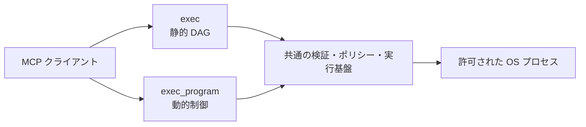

# os-exec-mcp ドキュメント

このディレクトリは、`os-exec-mcp` の利用者、運用者、コントリビューター向けの詳細ドキュメントです。README は導入と概要に絞り、設計上の根拠、実行時の振る舞い、セキュリティ境界、設定項目はここで説明します。

## 読み方

| 読みたい内容                           | ドキュメント                              |
| -------------------------------------- | ----------------------------------------- |
| システム全体とコードの責務             | [アーキテクチャ](./architecture.md)       |
| `exec`、DAG、`exec_program` の実行順序 | [実行フロー](./execution-flows.md)        |
| ツールの入力、出力、具体例             | [ツールリファレンス](./tool-reference.md) |
| ポリシー、環境変数、制限値             | [設定リファレンス](./configuration.md)    |
| 信頼境界、脅威、残存リスク             | [セキュリティモデル](./security-model.md) |

初めて読む場合は、次の順序を推奨します。

1. [アーキテクチャ](./architecture.md) の C4 Context 図で境界を理解する。
2. [実行フロー](./execution-flows.md) で `exec` と `exec_program` の使い分けを理解する。
3. [セキュリティモデル](./security-model.md) で「何を防ぎ、何を防がないか」を確認する。
4. [設定リファレンス](./configuration.md) から用途に合うポリシーを作る。
5. [ツールリファレンス](./tool-reference.md) を見ながら MCP クライアントを実装する。

## 設計の要約

`os-exec-mcp` は、MCP クライアントから受け取ったコマンドをローカル OS で実行する stdio サーバーです。ただし、任意のシェル文字列を受け付けるリモートシェルではありません。

- `exec` は、事前に依存関係が分かるコマンド群を一つの静的 DAG として実行します。
- `exec_program` は、前の出力によって次の `argv` や分岐が変わる処理を、隔離した QuickJS 内で組み立てます。
- どちらも同じコマンドポリシー、パス検査、プロセスランナー、出力制限、サーバー全体の FIFO 同時実行制限を通ります。
- OS プロセスは `argv` 配列から `shell: false` で起動されます。
- サーバーのポリシーがクライアントの要求より常に優先されます。

## 用語

| 用語                     | 意味                                                                   |
| ------------------------ | ---------------------------------------------------------------------- |
| ステップ                 | `exec.steps` の一要素。ID、`argv`、必要なら依存先を持つ                |
| 静的 DAG                 | リクエスト送信時点で全ステップと依存関係が確定している有向非巡回グラフ |
| 動的オーケストレーション | 実行結果を読んでから次のコマンドや分岐を決める処理                     |
| リクエスト内同時実行数   | 一つの `exec` または `exec_program` が同時に進められる処理数           |
| グローバル同時実行数     | サーバープロセス全体で同時に存在できる OS 子プロセス数                 |
| ポリシー拒否             | 入力形式ではなく、サーバーの権限ルールにより実行を許可しなかった結果   |
| 出力アーティファクト     | 切り詰めた出力を短時間だけ保持する、オプションの MCP Resource          |

## ドキュメントの保守方針

次の変更を行うときは、同じ PR で対応するドキュメントも更新してください。

- MCP ツールの入力・出力スキーマを変更したとき
- ポリシーフィールド、既定値、上限値を変更したとき
- スケジューラー、同時実行制御、キャンセルの意味を変更したとき
- QuickJS の公開 API または隔離境界を変更したとき
- 新しい外部依存、永続化、ネットワーク境界を追加したとき

Mermaid 図は、コードと異なる理想像ではなく、現在の実装を表すものとして保守します。実装の一次情報は `src/` とテストであり、図と実装が食い違う場合は両方を修正します。
