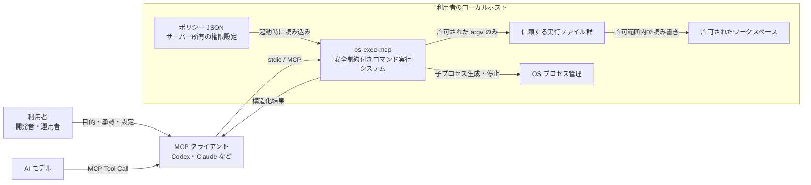
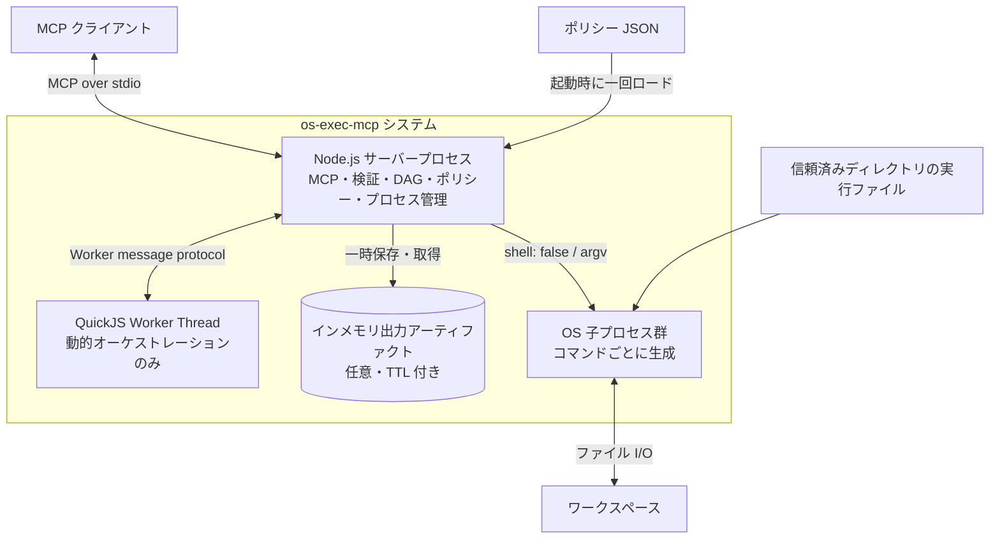
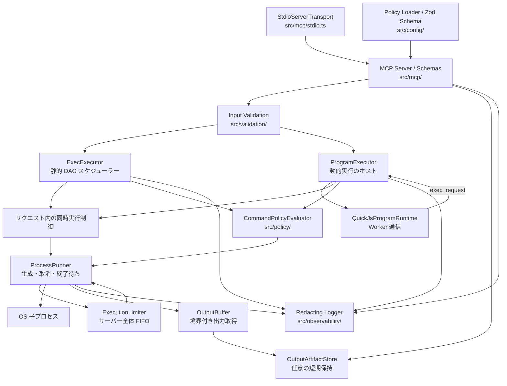
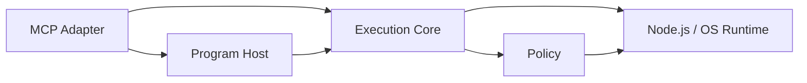
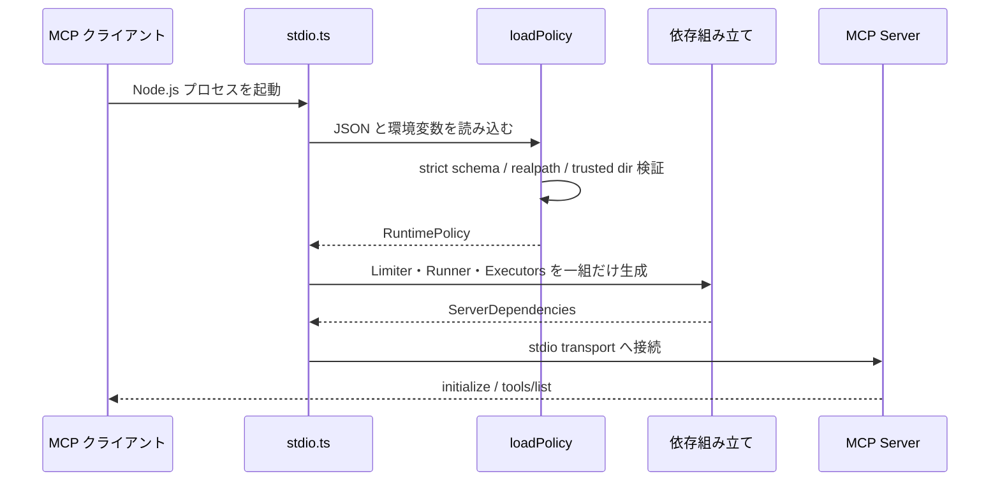
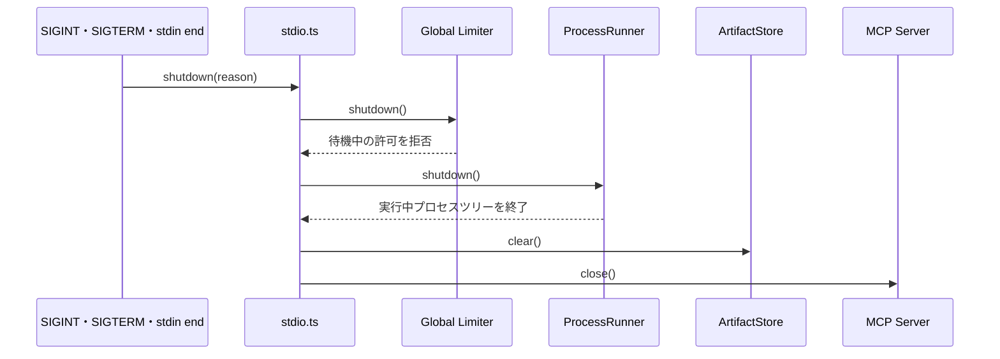

# os-exec-mcp アーキテクチャ

このドキュメントは、`os-exec-mcp` のシステム境界、実行単位、内部コンポーネント、依存方向を C4 モデルに沿って説明します。図は現在の TypeScript 実装と対応しており、将来構想ではありません。

## 目次

- [1. 目的と設計原則](#1-目的と設計原則)
- [2. C4 Level 1: System Context](#2-c4-level-1-system-context)
- [3. C4 Level 2: Container](#3-c4-level-2-container)
- [4. C4 Level 3: Component](#4-c4-level-3-component)
- [5. パッケージ構造](#5-パッケージ構造)
- [6. 依存関係と不変条件](#6-依存関係と不変条件)
- [7. 起動と終了](#7-起動と終了)
- [8. 外部依存](#8-外部依存)
- [9. 変更時の判断基準](#9-変更時の判断基準)

## 1. 目的と設計原則

### 1.1 解決する問題

一般的なモデル駆動のツール実行では、「コマンドを一つ呼ぶ → モデルが結果を読む → 次のコマンドを呼ぶ」という往復が増えます。`os-exec-mcp` は、次の二つの実行方式によってこの往復を減らします。

1. 依存関係が既知なら、全コマンドを `exec` の DAG として一回で渡す。
2. 後続処理が前の出力に依存するなら、`exec_program` 内で結果を読み、次の処理を決める。

同時に、モデルが任意のシェルを操作する構造を避け、サーバーが実行権限とリソース上限を所有します。

### 1.2 設計原則

| 原則                     | 実装上の意味                                                            |
| ------------------------ | ----------------------------------------------------------------------- |
| サーバーが権限を持つ     | クライアントはポリシー上限を緩められない                                |
| シェルを介さない         | コマンドは必ず `argv` 配列で受け、`spawn(..., { shell: false })` を使う |
| 静的処理を優先する       | グラフが既知なら、監査しやすい `exec` を使う                            |
| 動的処理を隔離する       | `exec_program` は QuickJS Worker 内で動かし、公開 API を四つに限定する  |
| 同時実行を二段で制御する | リクエスト内上限とサーバー全体上限を別々に適用する                      |
| 出力もリソースとして扱う | stdout / stderr / 最終レスポンスをバイト数で制限する                    |
| 失敗を構造化する         | 各ステップの状態、拒否理由、依存によるスキップを結果に残す              |
| MCP と実行コアを分離する | 実行層は MCP トランスポート型に依存しない                               |

### 1.3 対象外

このシステム自体は、次の機能を提供しません。

- 対話型 TTY、標準入力、バックグラウンドデーモンの管理
- シェル構文、パイプ、リダイレクト、コマンド置換の解釈
- コンテナや VM と同等の OS サンドボックス
- 永続ジョブキュー、分散スケジューラー、実行結果の長期保存
- コマンド結果をまたいだ自動キャッシュ

## 2. C4 Level 1: System Context

System Context は、`os-exec-mcp` を一つのシステムとして見た境界です。



### 2.1 関係者と責務

| 要素             | 責務                                                  | 信頼上の扱い         |
| ---------------- | ----------------------------------------------------- | -------------------- |
| 利用者           | ワークスペースとポリシーを選び、外部副作用を承認する  | 管理主体             |
| AI モデル        | `exec` / `exec_program` の入力を生成する              | 誤り得る入力元       |
| MCP クライアント | stdio サーバーの起動、Tool Call、キャンセルを仲介する | 境界外               |
| `os-exec-mcp`    | 入力検証、権限判定、スケジュール、プロセス制御を行う  | セキュリティ境界     |
| ポリシー JSON    | 実行可能コマンド、パス、環境変数、上限を定義する      | サーバー所有設定     |
| ワークスペース   | コマンドが操作できるファイル領域                      | 保護対象             |
| 実行ファイル     | 実際の処理と副作用を発生させる                        | ポリシーに応じて信頼 |

重要なのは、QuickJS が OS コマンドを直接実行しないことです。QuickJS 内の `exec` はホストへ要求を返し、通常のポリシー評価を通過した場合だけ子プロセスが作られます。

## 3. C4 Level 2: Container

ここでいう Container は Docker コンテナに限定せず、実行時に独立した責務を持つプロセスまたはスレッドを表します。



### 3.1 Container の責務

| Container                  | 技術                                    | 責務                                             | ライフサイクル              |
| -------------------------- | --------------------------------------- | ------------------------------------------------ | --------------------------- |
| Node.js サーバープロセス   | Node.js 20.19+ / TypeScript 出力        | stdio、入力検証、ポリシー、実行制御、ログ        | MCP セッション単位          |
| QuickJS Worker Thread      | `worker_threads` / `quickjs-emscripten` | 信頼しない ECMAScript の評価、動的なコマンド選択 | `exec_program` 呼び出し単位 |
| OS 子プロセス              | OS の実行ファイル                       | 実際の読み書き、ビルド、テストなど               | コマンド単位                |
| 出力アーティファクトストア | Node.js のインメモリ Map                | 切り詰められた出力の短期保持                     | サーバープロセス単位        |

### 3.2 永続性

通常のコマンド結果と出力アーティファクトはメモリ上だけに存在します。サーバー再起動、正常終了、異常終了で失われます。ファイルへの永続化を行うのは、許可された子プロセスがワークスペースに書き込んだ場合だけです。

## 4. C4 Level 3: Component

Node.js サーバープロセス内部の主要コンポーネントを示します。



### 4.1 コンポーネントの責務

| コンポーネント         | 主なファイル                            | 責務                                                       |
| ---------------------- | --------------------------------------- | ---------------------------------------------------------- |
| MCP エントリーポイント | `src/mcp/stdio.ts`                      | 依存の組み立て、stdio 接続、シグナル処理、終了順序         |
| MCP サーバー           | `src/mcp/server.ts`                     | Tool / Resource 登録、結果の compact 化、MCP エラー化      |
| MCP スキーマ           | `src/mcp/schema.ts`                     | 外部公開する入出力スキーマ                                 |
| 設定ロード             | `src/config/load.ts`                    | JSON と環境変数の統合、実パス化、起動時検証                |
| 設定スキーマ           | `src/config/schema.ts`                  | 既定値、型、絶対上限、相互制約                             |
| 入力検証               | `src/validation/`                       | DAG の重複・未知依存・循環、要求値とサーバー上限の比較     |
| `ExecExecutor`         | `src/executor/exec-executor.ts`         | ready queue、依存解除、`continue` / `fail_fast`、結果順序  |
| `ProgramExecutor`      | `src/program/program-executor.ts`       | QuickJS からの要求検証、許可名の絞り込み、回数・並列数制限 |
| QuickJS ランタイム     | `src/program/quickjs-runtime.ts`        | Worker の開始、メッセージ橋渡し、期限・中断、Worker 終了   |
| QuickJS ゲスト         | `src/program/quickjs-worker.ts`         | `exec`、`parallel`、`lines`、`finish` のみを公開           |
| ポリシー評価           | `src/policy/command-policy.ts`          | 実行ファイル、サブコマンド、cwd、環境変数、強制引数の決定  |
| パス評価               | `src/policy/path-policy.ts`             | `realpath` 後のワークスペース包含確認                      |
| グローバル制限         | `src/executor/execution-limiter.ts`     | 全リクエスト共通の FIFO 実行許可                           |
| プロセス実行           | `src/executor/process-runner.ts`        | `spawn`、タイムアウト、キャンセル、終了状態の構造化        |
| プロセスツリー終了     | `src/executor/process-tree.ts`          | POSIX プロセスグループまたは Windows `taskkill` の終了     |
| 出力取得               | `src/executor/output-buffer.ts`         | head / head-tail、ANSI 除去、UTF-8 境界、総バイト数        |
| 出力の短期保持         | `src/executor/output-artifact-store.ts` | 不透明 URI、TTL、サーバー全体の保持量上限                  |
| ログ                   | `src/observability/logger.ts`           | stderr への JSONL、機密フィールドのマスク                  |

## 5. パッケージ構造

```text
src/
├── config/          ポリシーの型、既定値、起動時ロード
├── executor/        DAG、同時実行、プロセス、出力、互換アダプター
├── mcp/             MCP の公開スキーマ、Tool / Resource、stdio
├── observability/   構造化ログと機密値マスク
├── policy/          実行ファイル・引数・環境・パスの権限判定
├── program/         QuickJS Worker と動的オーケストレーション
└── validation/      外部入力の構造・上限・DAG 検証

test/
├── unit/            境界値、ポリシー、バッファ、リミッター
└── integration/     プロセス、DAG、QuickJS、stdio MCP の結合
```

レガシーの `BatchExecutor` と `WorkflowExecutor` は独立したスケジューラーではなく、`ExecExecutor` へ変換して渡す互換アダプターです。新しい機能は `ExecExecutor` に実装し、レガシー側へ複製しません。

## 6. 依存関係と不変条件

### 6.1 依存方向



実行コアと Program Host は MCP SDK のクラスを import しません。別トランスポートへ組み込む場合でも、ポリシー評価とプロセス制御を再利用できます。

### 6.2 必ず守る不変条件

1. 全 OS コマンドは `CommandPolicyEvaluator.prepare` を通る。
2. 全 OS 子プロセスは同じ `ProcessRunner` とグローバル `ExecutionLimiter` を通る。
3. クライアント要求の上限値は、サーバーポリシーの絶対上限を超えられない。
4. `cwd` は `realpath` 後に少なくとも一つの `workspaceRoots` 内にある。
5. 実行ファイルは信頼済みディレクトリか、コマンド規則の絶対 `path` から解決する。
6. シェルと権限昇格コマンドは、ポリシーモードに関係なく拒否する。
7. `exec` の結果配列は完了順ではなく入力順を保つ。
8. `exec_program` は `finish(value)` を一回だけ呼び、未完了の `exec` を残さない。
9. サーバー終了時は待機中の許可、実行中のプロセス、Worker、アーティファクトを終了・破棄する。

## 7. 起動と終了

### 7.1 起動フロー



設定が不正、ワークスペースが存在しない、信頼済み実行ディレクトリが一つもない場合は、Tool Call を受け付ける前に起動を失敗させます。

### 7.2 終了フロー



POSIX では子プロセスを独立したプロセスグループとして起動し、まず `SIGTERM`、500 ms 後も残る場合は `SIGKILL` を送ります。Windows では `taskkill.exe /T /F` を使い、失敗時は子プロセスへの終了要求へフォールバックします。

## 8. 外部依存

| 依存                        | 用途                               | 境界                           |
| --------------------------- | ---------------------------------- | ------------------------------ |
| `@modelcontextprotocol/sdk` | MCP stdio、Tool、Resource          | トランスポート層のみ           |
| `quickjs-emscripten`        | ECMAScript の隔離実行              | `src/program/` のみ            |
| `zod`                       | 設定・Tool 入力・Worker 要求の検証 | 境界入力                       |
| Node.js `child_process`     | OS 子プロセスの生成と終了          | `ProcessRunner` / process tree |
| Node.js `worker_threads`    | QuickJS の分離と強制終了           | QuickJS runtime                |

`os-exec-mcp` 自体はネットワーク API を呼びません。ただし、許可した `git`、パッケージマネージャー、独自 CLI などの子プロセスはネットワークを使用できます。ネットワーク制御が必要な場合は、OS またはコンテナ側でも制限してください。

## 9. 変更時の判断基準

### 新しい Tool を追加する前に

- 静的 DAG なら `exec` で表現できないか。
- 動的な出力依存なら `exec_program` のゲスト API で表現できないか。
- Tool を増やすことでモデルの選択負荷と互換性コストが増えないか。

### 新しい実行経路を追加する前に

- `CommandPolicyEvaluator` を必ず通るか。
- 共通の `ProcessRunner` とグローバル制限を迂回しないか。
- タイムアウト、キャンセル、サーバー終了でプロセスツリーを回収できるか。
- stdout、stderr、最終レスポンスの上限があるか。
- ログに `argv`、環境変数、出力本文、資格情報を残さないか。

### アーキテクチャ変更時のテスト

- 単体テスト: 入力境界、循環、ポリシー拒否、バッファ、リミッター
- 統合テスト: 実プロセス、依存解除、fail-fast、キャンセル、子孫終了
- MCP 結合テスト: initialize、tools/list、Tool Call、Resource 取得、レガシー公開条件
- QuickJS 結合テスト: 動的分岐、並列処理、回数・時間・メモリ・返却量制限
