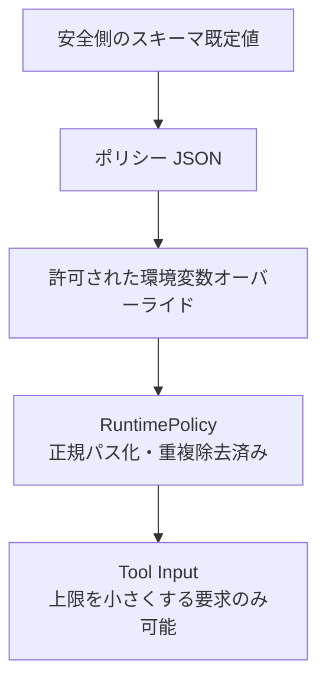

# 設定リファレンス

`os-exec-mcp` の権限とリソース上限は、サーバー起動者が所有するポリシー JSON で決まります。Tool Input は一部の値を小さくできますが、ポリシーの絶対上限を超えて拡張することはできません。

## 目次

- [1. 設定方法と優先順位](#1-設定方法と優先順位)
- [2. 起動オプション](#2-起動オプション)
- [3. 環境変数](#3-環境変数)
- [4. ポリシーフィールド](#4-ポリシーフィールド)
- [5. コマンド規則](#5-コマンド規則)
- [6. パス解決](#6-パス解決)
- [7. 構成例](#7-構成例)
- [8. レガシー移行](#8-レガシー移行)
- [9. 起動時検証とトラブルシューティング](#9-起動時検証とトラブルシューティング)

## 1. 設定方法と優先順位



優先順位は次の通りです。

1. `src/config/schema.ts` の既定値
2. `OS_EXEC_POLICY_FILE` で指定した strict JSON
3. 対応する `OS_EXEC_*` 環境変数
4. Tool Input の個別要求。ただしサーバー上限以下に限定

ポリシー JSON は strict schema です。未知のフィールドや型の違いを無視せず、起動を失敗させます。

ポリシーファイルを指定しない場合は、`git` の安全な読み取りサブコマンド、`rg`、`ls`、`find`、`cat`、`head`、`tail`、`wc`、`stat`、`du`、`pwd` だけを許可した読み取り専用 allowlist が使われます。

## 2. 起動オプション

### 2.1 通常起動

```bash
npx -y os-exec-mcp
```

引数なしでは、ポリシーファイルまたは既定の読み取り専用ポリシーを使います。

### 2.2 開発モード

```bash
npx -y os-exec-mcp --development
```

`--development` は同梱の `examples/policy.development.json` を選び、`OS_EXEC_WORKSPACE_ROOT` が未指定なら起動時のカレントディレクトリを root にします。

`--development` と `OS_EXEC_POLICY_FILE` または旧 `OS_BATCH_POLICY_FILE` は同時指定できません。開発ポリシーは denylist であり、OS サンドボックスではありません。

これ以外の CLI 引数は受け付けません。

## 3. 環境変数

| 環境変数                 | 値                                             | 効果                                               |
| ------------------------ | ---------------------------------------------- | -------------------------------------------------- |
| `OS_EXEC_POLICY_FILE`    | JSON ファイルのパス                            | 読み込むポリシーを指定する                         |
| `OS_EXEC_WORKSPACE_ROOT` | ディレクトリパス                               | `workspaceRoots` を一つの root で置き換える        |
| `OS_EXEC_LOG_LEVEL`      | `debug` / `info` / `warn` / `error` / `silent` | JSONL ログの最小レベルを上書きする                 |
| `OS_EXEC_READ_ONLY`      | `true` / `false` / `1` / `0`                   | グローバル読み取り専用判定を上書きする             |
| `OS_EXEC_LEGACY_TOOLS`   | `true` / `false` / `1` / `0`                   | `batch_exec` と `workflow_exec` の公開を上書きする |

`OS_EXEC_POLICY_FILE` の相対パスはサーバー起動時のカレントディレクトリから解決します。`OS_EXEC_WORKSPACE_ROOT` の相対パスも起動時のカレントディレクトリから解決します。

環境変数はサーバー自身の設定です。Tool Input の `env` は子プロセスへ渡す限定的な値であり、これらのサーバー設定を変更しません。

## 4. ポリシーフィールド

以下はスキーマ既定値です。同梱のサンプルポリシーは用途に合わせて一部を上書きしています。

### 4.1 ワークスペースと実行量

| フィールド           |  既定値 |   設定可能範囲 | 意味                                                  |
| -------------------- | ------: | -------------: | ----------------------------------------------------- |
| `workspaceRoots`     | `["."]` |     1〜32 パス | `cwd` を許可するディレクトリ群                        |
| `maxBatchSize`       |    `16` |         1〜256 | 一つの `exec` に含められる最大ステップ数              |
| `maxConcurrency`     |    `16` |          1〜64 | リクエスト上限かつサーバー全体の OS プロセス上限      |
| `defaultConcurrency` |     `8` |          1〜64 | `concurrency` 省略時の値。`maxConcurrency` 以下が必要 |
| `defaultTimeoutMs`   | `10000` | 100〜600000 ms | 各コマンドの既定タイムアウト                          |
| `maxTimeoutMs`       | `60000` | 100〜600000 ms | 各コマンドが要求できる最大タイムアウト                |

### 4.2 出力とレスポンス

| フィールド                           |      既定値 |        設定可能範囲 | 意味                                 |
| ------------------------------------ | ----------: | ------------------: | ------------------------------------ |
| `defaultMaxOutputBytes`              |     `65536` |           1〜16 MiB | stdout / stderr 一本あたりの既定上限 |
| `absoluteMaxOutputBytes`             |   `1048576` |           1〜16 MiB | 一本あたりに要求できる絶対上限       |
| `defaultMaxTotalOutputBytes`         |     `65536` |           2〜16 MiB | `exec` リクエスト全体の既定出力予算  |
| `absoluteMaxTotalOutputBytes`        |   `1048576` |           2〜16 MiB | 全体出力予算の絶対上限               |
| `absoluteMaxSerializedResponseBytes` |   `2097152` |       1 KiB〜32 MiB | MCP へ返す最終 JSON の絶対上限       |
| `defaultOutputMode`                  | `"compact"` | `compact` / `debug` | `exec.output.mode` 省略時の射影      |
| `persistTruncatedOutput`             |     `false` |             boolean | 切り詰め出力の短期 Resource 化       |
| `persistedOutputTtlMs`               |    `300000` |       1 秒〜24 時間 | 出力アーティファクトの TTL           |
| `persistedOutputMaxBytes`            |   `4194304` |       1 KiB〜64 MiB | サーバー全体で保持する最大バイト数   |

`defaultMaxOutputBytes <= absoluteMaxOutputBytes`、`defaultMaxTotalOutputBytes <= absoluteMaxTotalOutputBytes` が必要です。

### 4.3 `exec_program`

| フィールド                      |      既定値 |   設定可能範囲 | 意味                               |
| ------------------------------- | ----------: | -------------: | ---------------------------------- |
| `defaultProgramMaxExecCalls`    |        `32` |         1〜256 | Program 内の既定 `exec` 呼び出し数 |
| `absoluteProgramMaxExecCalls`   |       `256` |        1〜1024 | 呼び出し数の絶対上限               |
| `defaultProgramTimeoutMs`       |     `10000` | 100〜600000 ms | Program 全体の既定期限             |
| `absoluteProgramTimeoutMs`      |     `60000` | 100〜600000 ms | Program 全体期限の絶対上限         |
| `defaultProgramMemoryBytes`     |  `67108864` |   8 MiB〜1 GiB | QuickJS の既定メモリ上限           |
| `absoluteProgramMemoryBytes`    | `268435456` |   8 MiB〜1 GiB | QuickJS メモリの絶対上限           |
| `defaultProgramMaxReturnBytes`  |     `65536` |      1〜16 MiB | `finish(value)` の既定 JSON 上限   |
| `absoluteProgramMaxReturnBytes` |   `1048576` |      1〜16 MiB | Program 返却値の絶対上限           |

各 `defaultProgram*` は対応する `absoluteProgram*` 以下でなければなりません。

### 4.4 コマンド権限と運用

| フィールド                     | 既定値                   | 意味                                               |
| ------------------------------ | ------------------------ | -------------------------------------------------- |
| `allowedEnvironmentKeys`       | `[]`                     | Tool Input の `env` から受け付けるキー。最大 64    |
| `trustedExecutableDirectories` | 未指定                   | 実行ファイルを探索するディレクトリ。最大 64        |
| `inheritExecutablePath`        | `false`                  | 親 PATH の絶対ディレクトリを信頼済み候補へ追加する |
| `commandMode`                  | `"allowlist"`            | 未登録コマンドを拒否するか、原則許可するか         |
| `deniedCommands`               | `[]`                     | denylist モードで拒否する実行ファイル名。最大 256  |
| `commands`                     | 読み取り用既定コマンド群 | 実行ファイルごとの規則                             |
| `logLevel`                     | `"info"`                 | stderr JSONL のログレベル                          |
| `readOnly`                     | `true`                   | `readOnly: true` のコマンドだけを許可する          |
| `legacyTools`                  | `false`                  | 0.x 互換 Tool を公開する                           |

`trustedExecutableDirectories` を明示しない場合、Node.js 実行ファイルのディレクトリと OS の標準ディレクトリを候補にします。`inheritExecutablePath: true` なら親 PATH も候補へ加えます。明示したディレクトリが存在しない、読めない、実行検索できない場合は起動エラーです。

## 5. コマンド規則

`commands` は実行ファイル名から次の規則への map です。

| フィールド           | 既定値  | 意味                                       |
| -------------------- | ------- | ------------------------------------------ |
| `allowed`            | `false` | このコマンドを許可する                     |
| `path`               | 未指定  | 使用する実行ファイルの明示パス             |
| `allowedSubcommands` | 未指定  | `argv[1]` として許可する値の一覧。最大 128 |
| `readOnly`           | `false` | グローバル読み取り専用時にも許可できる分類 |

```json
{
  "commands": {
    "git": {
      "allowed": true,
      "allowedSubcommands": ["status", "diff", "log", "show", "rev-parse"],
      "readOnly": true
    },
    "my-tool": {
      "allowed": true,
      "path": "/opt/company/bin/my-tool",
      "readOnly": false
    }
  }
}
```

`allowedSubcommands` を指定すると、最初の引数が一覧にない要求と、サブコマンド自体がない要求を拒否します。引数全体の意味を解析する仕組みではないため、複雑な CLI には専用ラッパーや OS サンドボックスも検討してください。

denylist モードで `commands` に規則がない実行ファイルは、`allowed: true, readOnly: false` 相当です。グローバル `readOnly: true` なら、未登録コマンドは最終的に拒否されます。

## 6. パス解決

### 6.1 ポリシーファイル内のパス

- `workspaceRoots`: ポリシーファイルのあるディレクトリから解決
- 明示した `trustedExecutableDirectories`: ポリシーファイルのあるディレクトリから解決
- `commands.*.path`: 実行時に実体とポリシーを検査

すべての root と信頼済みディレクトリは起動時に正規パスへ変換します。

### 6.2 Tool Input の `cwd`

- 省略: 最初の `workspaceRoots`
- 相対パス: 最初の root から解決
- 絶対パス: そのまま候補にする
- 最終判定: `realpath` 後にいずれかの root 内であること

存在しないディレクトリを将来作る目的で `cwd` に指定することはできません。親ディレクトリを `cwd` にし、許可コマンドの引数として新しいパスを渡します。

## 7. 構成例

### 7.1 読み取り専用 allowlist

完全な例は [`examples/policy.read-only.json`](../examples/policy.read-only.json) にあります。

```json
{
  "workspaceRoots": ["."],
  "maxConcurrency": 8,
  "defaultConcurrency": 4,
  "commandMode": "allowlist",
  "readOnly": true,
  "inheritExecutablePath": false,
  "commands": {
    "git": {
      "allowed": true,
      "allowedSubcommands": ["status", "diff", "log", "show", "rev-parse", "ls-files"],
      "readOnly": true
    },
    "rg": {
      "allowed": true,
      "readOnly": true
    }
  }
}
```

### 7.2 信頼済み開発 denylist

完全な例は [`examples/policy.development.json`](../examples/policy.development.json) にあります。

```json
{
  "workspaceRoots": ["."],
  "maxConcurrency": 16,
  "defaultConcurrency": 8,
  "commandMode": "denylist",
  "readOnly": false,
  "inheritExecutablePath": true,
  "deniedCommands": ["rm", "sudo", "ssh", "docker"]
}
```

この短縮例だけをコピーするのではなく、同梱例の完全な拒否リストを基準にしてください。

### 7.3 切り詰め出力の短期取得

```json
{
  "persistTruncatedOutput": true,
  "persistedOutputTtlMs": 120000,
  "persistedOutputMaxBytes": 2097152,
  "defaultMaxTotalOutputBytes": 65536,
  "absoluteMaxSerializedResponseBytes": 2097152
}
```

保持量上限に達した出力は Resource 化されず、通常の切り詰め結果だけが返ります。

## 8. レガシー移行

### 8.1 Tool 名

`legacyTools` または `OS_EXEC_LEGACY_TOOLS` を有効にすると、次の互換 Tool を追加公開します。

- `batch_exec`
- `workflow_exec`

両方とも内部では `exec` へ変換するアダプターです。新しいクライアントは `exec.steps` を使ってください。

### 8.2 環境変数名

次の旧名は 0.x 移行用 alias です。

| 新しい名前               | 旧 alias                  |
| ------------------------ | ------------------------- |
| `OS_EXEC_POLICY_FILE`    | `OS_BATCH_POLICY_FILE`    |
| `OS_EXEC_WORKSPACE_ROOT` | `OS_BATCH_WORKSPACE_ROOT` |
| `OS_EXEC_LOG_LEVEL`      | `OS_BATCH_LOG_LEVEL`      |
| `OS_EXEC_READ_ONLY`      | `OS_BATCH_READ_ONLY`      |

新旧を異なる値で同時指定すると、安全のため起動を失敗させます。

## 9. 起動時検証とトラブルシューティング

### 起動時に確認すること

- ポリシー JSON が構文的に正しい
- 未知フィールドがない
- 既定値が絶対上限以下
- `defaultConcurrency <= maxConcurrency`
- `defaultTimeoutMs <= maxTimeoutMs`
- root と信頼済みディレクトリが存在する
- 信頼済みディレクトリが一つ以上使える
- boolean 環境変数が許可形式である

### 代表的な失敗

| 症状                                           | 確認点                                                  |
| ---------------------------------------------- | ------------------------------------------------------- |
| `Policy file validation failed`                | フィールド名、型、範囲、default / absolute の関係       |
| `workspace root ... does not exist`            | ポリシーファイル基準の相対パスか、環境変数基準のパスか  |
| `No trusted executable directory is available` | 明示ディレクトリ、Node.js、OS 標準ディレクトリ          |
| コマンドが `command_not_allowed`               | `commandMode` と `commands.*.allowed`                   |
| `subcommand_not_allowed`                       | `argv[1]` が `allowedSubcommands` にあるか              |
| `read_only_policy`                             | グローバル `readOnly` とコマンド規則の `readOnly`       |
| `cwd_outside_workspace`                        | symlink 解決後のパスが root 内か                        |
| `timeout_exceeds_policy`                       | Tool Input を小さくするか `maxTimeoutMs` を管理者が変更 |

拒否された同じ要求をそのまま再試行しても結果は変わりません。Tool Input を変更するか、サーバー管理者がポリシーを見直してください。
