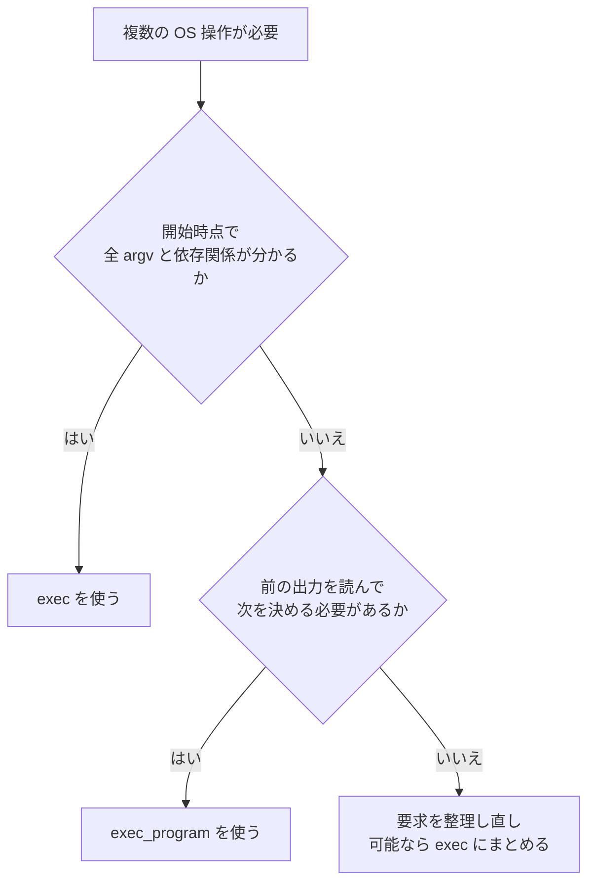
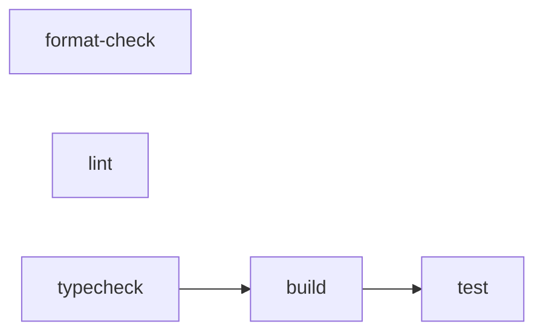
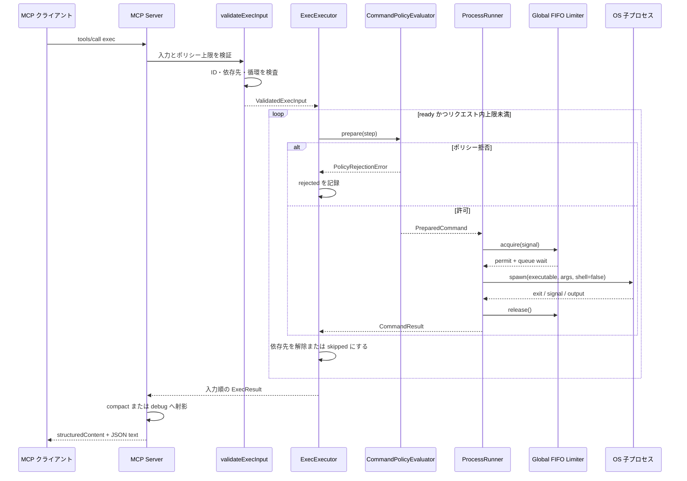
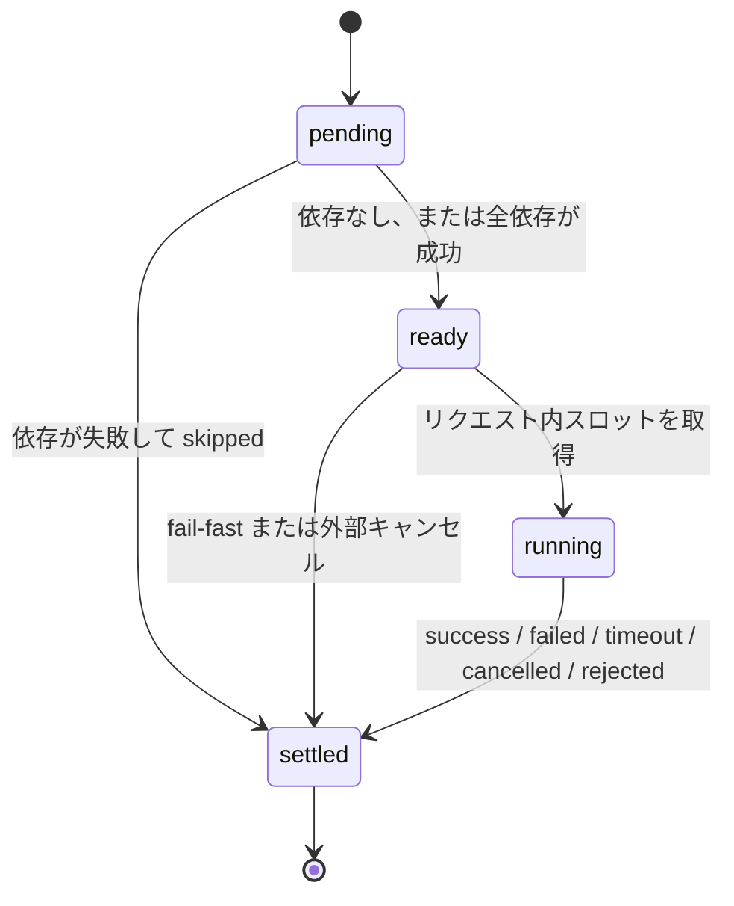
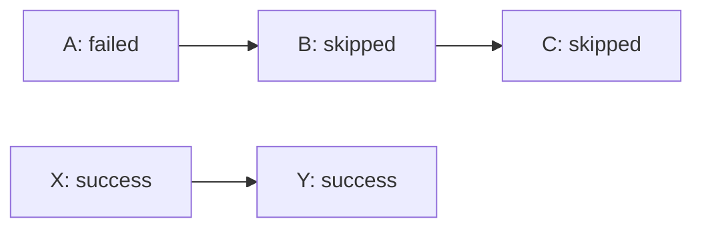
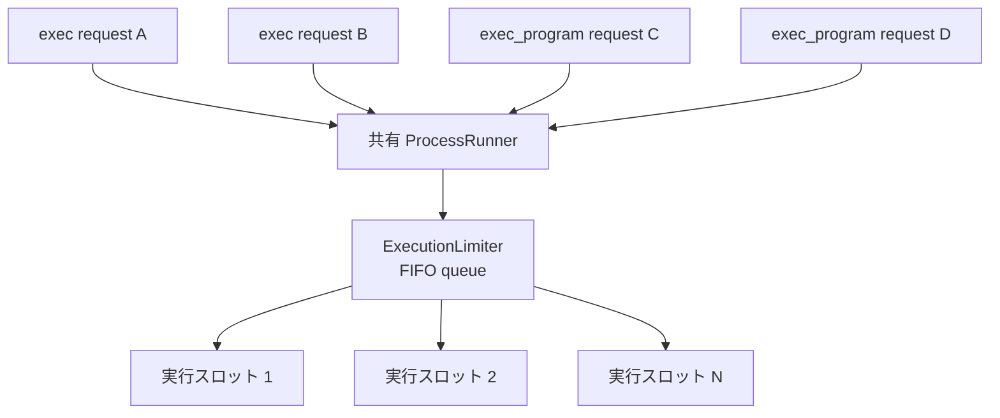
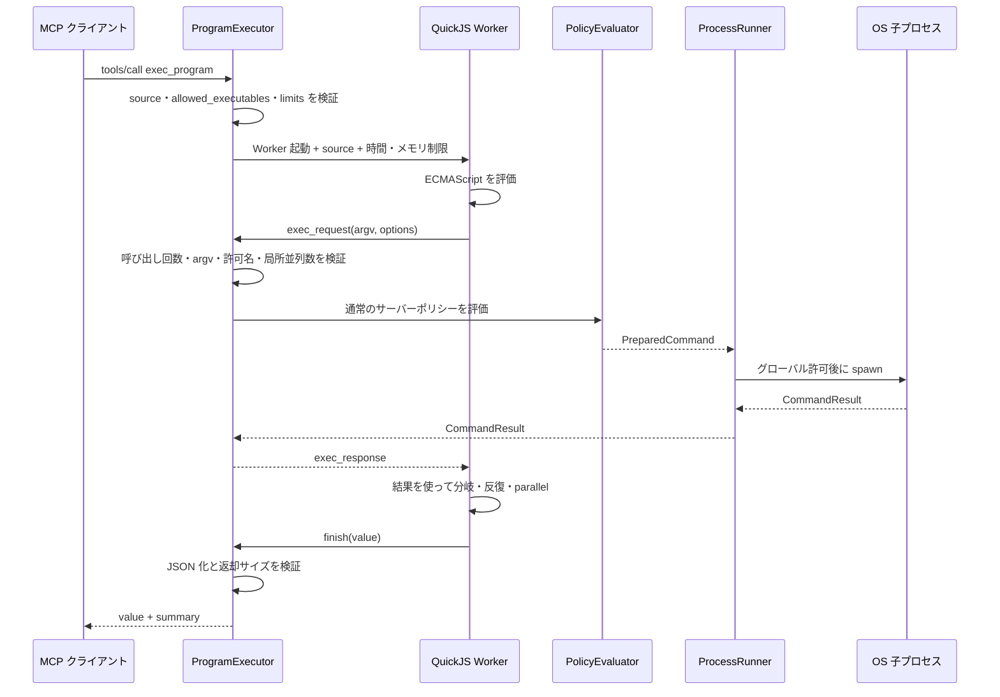
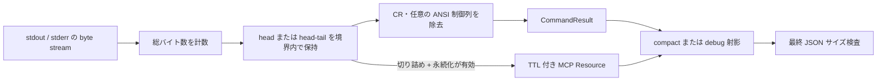
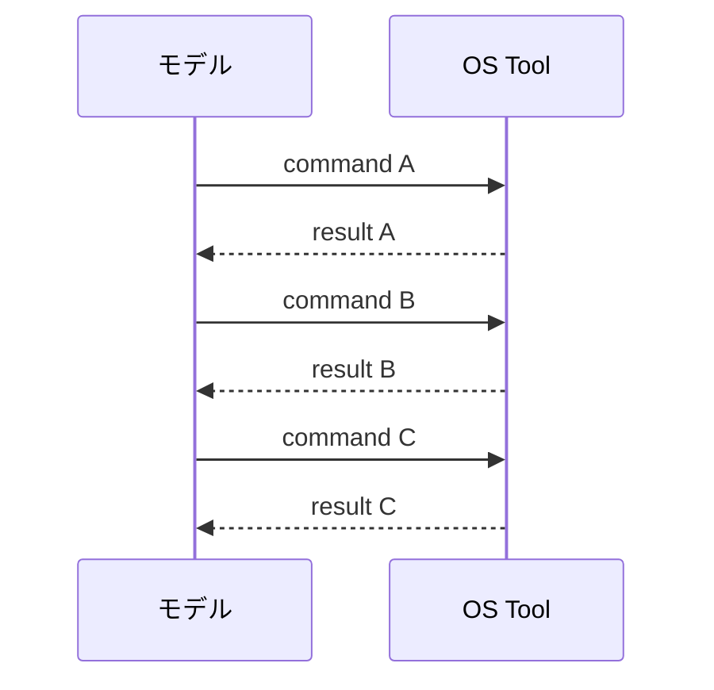
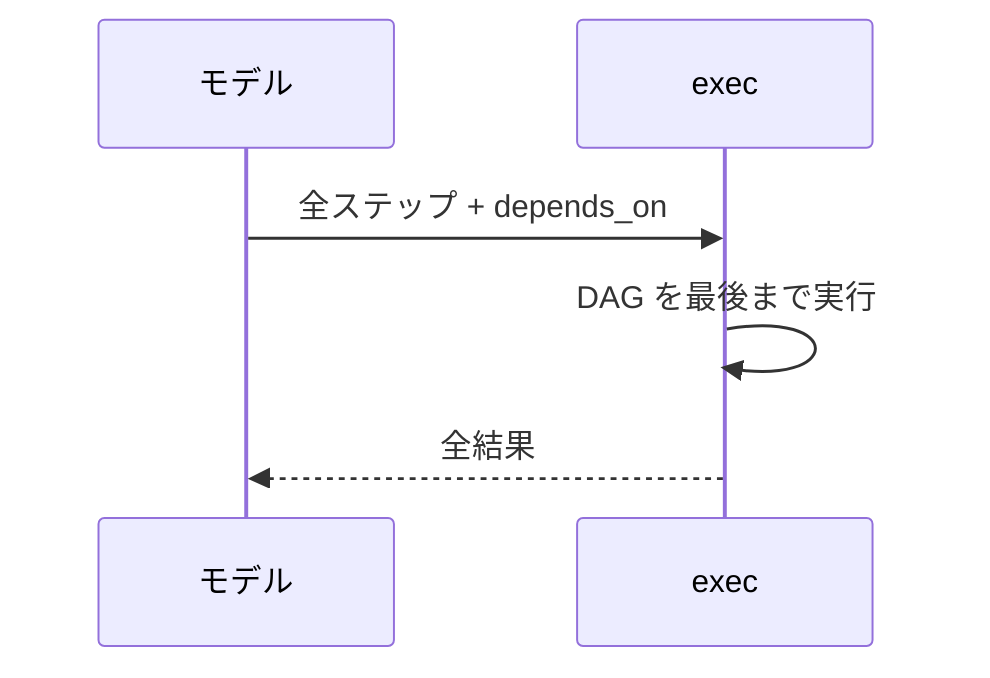

# 実行フロー

このドキュメントは、`exec` と `exec_program` が一つの Tool Call を受け取ってから結果を返すまでの流れを説明します。入力例の詳細は [ツールリファレンス](./tool-reference.md)、権限判定は [セキュリティモデル](./security-model.md) を参照してください。

## 目次

- [1. 実行方式の選択](#1-実行方式の選択)
- [2. exec: 静的 DAG](#2-exec-静的-dag)
- [3. DAG スケジューラー](#3-dag-スケジューラー)
- [4. 失敗・拒否・キャンセル](#4-失敗拒否キャンセル)
- [5. グローバル同時実行制限](#5-グローバル同時実行制限)
- [6. exec_program: 動的オーケストレーション](#6-exec_program-動的オーケストレーション)
- [7. 出力処理](#7-出力処理)
- [8. モデル呼び出し回数が減る理由](#8-モデル呼び出し回数が減る理由)

## 1. 実行方式の選択



| 条件                                     | 推奨           | 理由                               |
| ---------------------------------------- | -------------- | ---------------------------------- |
| 独立した複数コマンド                     | `exec`         | `depends_on` なしで並列化できる    |
| build 後に test など依存が既知           | `exec`         | 一つの静的 DAG として監査できる    |
| 検索結果のファイル名を次の `argv` に使う | `exec_program` | 後続の `argv` が開始時に確定しない |
| 結果によって分岐・繰り返し回数が変わる   | `exec_program` | QuickJS 内で制御フローを完結できる |
| 一つのコマンドだけ                       | `exec`         | 動的ランタイムを起動する必要がない |

`exec_program` は高機能な上位互換ではありません。静的 DAG の方が入力全体を事前検証でき、依存関係と副作用の順序が明示され、Worker 起動コストもありません。

## 2. `exec`: 静的 DAG

### 2.1 例となるグラフ

次のグラフでは、`format-check` と `lint` は独立に開始でき、`test` は `build` の成功後だけ開始します。



依存線がない `format-check`、`lint`、`typecheck` は ready queue に同時に入り、リクエスト内 `concurrency` とグローバル制限の範囲で開始されます。

### 2.2 リクエスト全体のシーケンス



### 2.3 入力検証

プロセスを一つも起動する前に、リクエスト全体を検証します。

- `steps` が空でないこと、サーバーの `maxBatchSize` 以下であること
- ステップ ID が重複しないこと
- `depends_on` が自分自身、重複、未知の ID を含まないこと
- グラフに循環がないこと
- `concurrency`、タイムアウト、出力要求がサーバー上限以下であること
- リクエスト全体の出力予算を全ステップの stdout / stderr に最低 1 byte ずつ配分できること

実行ファイル、サブコマンド、`cwd`、環境変数の許可は各ステップが開始される直前に評価します。これにより、個別ステップは `rejected` として構造化できます。

## 3. DAG スケジューラー

### 3.1 ステップ状態



内部状態は `pending`、`ready`、`running`、`settled` の四つです。外部へ返す `status` とは別であり、`settled` の中に `success` や `failed` などの最終状態があります。

### 3.2 ready queue

1. 依存のないステップを入力順に ready queue へ入れる。
2. `running < effectiveConcurrency` の間、先頭から開始する。
3. ステップが完了したら、そのステップに依存するノードを確認する。
4. 全依存が `success` なら ready queue へ入れる。
5. 一つでも非 `success` なら、実行せず `skipped` とし、`blocked_by` に原因 ID を入れる。
6. 全ステップが `settled` になったら結果を入力順に返す。

完了順が違っても、`results` は常に入力された `steps` の順です。呼び出し側は ID 検索だけでなく、宣言順でも結果を対応付けられます。

### 3.3 二種類の同時実行数

`effective_concurrency` は、一つの `exec` リクエスト内で同時に `running` にできる最大数です。実際に OS プロセスを開始できるかは、さらにサーバー全体のグローバル制限で決まります。

```text
実際の同時 OS プロセス数
  <= 各リクエストの concurrency
  <= サーバーの maxConcurrency
  かつ
全リクエスト合計 <= サーバーの maxConcurrency
```

## 4. 失敗・拒否・キャンセル

### 4.1 ステータス

| status        | 意味                                      | OS プロセス                  |
| ------------- | ----------------------------------------- | ---------------------------- |
| `success`     | 終了コード 0                              | 開始済み                     |
| `failed`      | 0 以外で終了                              | 開始済み                     |
| `timeout`     | ステップの期限を超過                      | 開始後にプロセスツリーを停止 |
| `cancelled`   | MCP キャンセル、fail-fast、終了処理など   | 開始前または開始後に停止     |
| `skipped`     | 依存失敗または fail-fast で開始しなかった | 開始しない                   |
| `rejected`    | サーバーポリシーが許可しなかった          | 開始しない                   |
| `spawn_error` | 許可後のプロセス生成自体に失敗            | 生成未完了                   |

### 4.2 `continue`

`continue` は既定値です。失敗したステップの子孫だけを `skipped` にし、依存しない枝は続行します。



部分的な結果にも価値がある検索、検査、複数パッケージの独立チェックに向いています。

### 4.3 `fail_fast`

どれか一つが非 `success` になった時点で、新しいステップを開始せず、実行中のステップへキャンセルを伝播します。未開始ステップは `skipped`、実行中ステップは通常 `cancelled` になります。

すでに完了したファイル書き込みや外部副作用はロールバックされません。`fail_fast` はトランザクションではありません。

### 4.4 外部キャンセルとタイムアウト

MCP リクエストのキャンセル、Program 終了、サーバー終了は `AbortSignal` としてプロセスランナーまで伝わります。開始済みプロセスは単体ではなくプロセスツリー単位で停止します。

## 5. グローバル同時実行制限

### 5.1 なぜ必要か

各リクエストだけを `concurrency: 8` に制限しても、同時に十件のリクエストが来れば最大 80 プロセスが起動し得ます。グローバル制限は、すべての `exec` と `exec_program` を一つの FIFO キューに集め、サーバー全体の上限を守ります。



### 5.2 許可の流れ

1. `ProcessRunner.run` が `acquire(signal)` を呼ぶ。
2. 空きがあり、待機列も空なら直ちに許可する。
3. それ以外は到着順に待機する。
4. 実行完了時に必ず `release()` し、待機列の先頭へ許可を渡す。
5. 待機中にキャンセルされた項目は列から除去する。
6. サーバー終了時は待機中の全項目を `shutdown` として拒否する。

結果の `global_queue_wait_ms` は、グローバル許可を待った時間です。`compact` モードでは 0 の場合に省略されます。

## 6. `exec_program`: 動的オーケストレーション

### 6.1 実行境界



### 6.2 ゲスト API

| API                                  | 役割                                                       |
| ------------------------------------ | ---------------------------------------------------------- |
| `exec(argv, options?)`               | 一つのコマンドをホストへ要求し、`CommandResult` を返す     |
| `parallel(operations, concurrency?)` | 複数の関数または argv を指定数まで並行実行し、入力順で返す |
| `lines(value)`                       | 文字列または `CommandResult.stdout` を行配列へ変換する     |
| `finish(value)`                      | 最終 JSON 値を一回だけホストへ返す                         |

QuickJS から Node.js の `fs`、`child_process`、`process`、`require`、ネットワーク API は公開しません。コマンド実行能力は `exec` のメッセージ橋渡しだけです。

### 6.3 多層の制限

一回の `exec_program` には、次の制限が重なります。

1. `allowed_executables`: その Program 呼び出しが要求できる実行ファイル名
2. サーバーコマンドポリシー: 実際の実行可否、サブコマンド、パス、環境
3. `max_exec_calls`: Program からの `exec` 総呼び出し数
4. `max_concurrency`: その Program 内の同時ホスト呼び出し数
5. グローバル `maxConcurrency`: サーバー全体の同時 OS プロセス数
6. `timeout_ms`: Program 全体の期限
7. `memory_bytes`: QuickJS ランタイムのメモリ上限
8. `max_return_bytes`: `finish(value)` の JSON バイト数

Program が終わると、未完了のコマンドへキャンセルを伝播し、局所リミッターと Worker を終了します。

## 7. 出力処理

### 7.1 出力予算

`exec` では、`output.max_total_bytes` を `ステップ数 × 2 ストリーム` に公平配分した値と、`max_stream_bytes` の小さい方を各 stdout / stderr の上限にします。したがって、ステップ数を増やしても一つの Tool Call が無制限に大きくなりません。



### 7.2 `head` と `head_tail`

- `head`: 先頭だけを保持する。冒頭の診断が重要な出力に向く。
- `head_tail`: 約 1/4 を先頭、残りを末尾に割り当て、省略バイト数のマーカーを挟む。テストログの開始情報と最後の失敗を両方残しやすい。

バイト境界で切り詰めた後も、不完全な UTF-8 文字を結果に残さないよう復号サイズを調整します。

### 7.3 compact と debug

`compact` は既定値で、空文字、0 の終了コード、0 件の失敗、0 ms の待機などを省略します。`debug` は全フィールドを返します。実行内容は同じであり、モードが権限やスケジュールを変えることはありません。

### 7.4 出力アーティファクト

`persistTruncatedOutput` が有効な場合だけ、切り詰められたストリームに `stdout_resource` または `stderr_resource` が付くことがあります。URI は `os-exec-output:///{id}` です。

- 保存先はメモリだけ
- URI は推測しにくい UUID
- `persistedOutputTtlMs` 後に取得不可
- サーバー全体の `persistedOutputMaxBytes` を超える場合は保存しない
- サーバー終了時に全件削除

## 8. モデル呼び出し回数が減る理由

### 8.1 逐次 Tool Call

モデルが毎回判断する方式では、五つの既知コマンドに少なくとも五回の Tool Call と、その間のモデル判断が必要です。



### 8.2 `exec`

静的 DAG なら、モデルは一回の Tool Call で全ステップを宣言します。その後の依存待ち、並列開始、失敗枝のスキップはサーバーが担当します。



### 8.3 `exec_program`

動的処理でも、モデルは制御プログラムを一回渡します。中間結果を読んで次の `argv` を作る処理は QuickJS 内で進むため、各中間結果をモデルへ戻す必要がありません。

削減できるのは「モデルと Tool の往復」です。OS コマンド自体の実行回数が自動的に減るわけではありません。キャッシュも実装していないため、同じリクエストを再実行すればコマンドも再実行されます。
