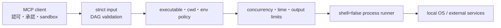

# セキュリティモデル

`os-exec-mcp` はMCPクライアントが生成したコマンド要求をローカルOSへ橋渡しします。
既定ポリシーはコマンド認可をクライアント側へ委譲し、ほぼすべての実行ファイルと
引数を許可します。このサーバー自体をOS sandboxとして扱ってはいけません。

## 1. 信頼境界



既定構成では、MCPクライアントと対象リポジトリを信頼します。モデルが操作してよい
対象、破壊的操作の承認、DockerやKubernetesなど外部能力の認可はクライアント側の
責任です。

サーバーが引き続き担当するのは、入力形式、workspaceの `cwd`、実行ファイル解決、
子プロセス環境、同時実行、タイムアウト、出力量、キャンセル、ログredactionです。

## 2. 既定コマンド方針

既定値は次のとおりです。

```json
{
  "commandMode": "denylist",
  "readOnly": false,
  "inheritExecutablePath": true,
  "deniedCommands": ["doas", "pkexec", "runas", "su", "sudo"],
  "commands": {}
}
```

したがって、`docker`、`kubectl`、`rm`、`nohup`、shell、runtime、package manager、
build toolを含むその他のコマンドは既定で許可されます。一般の引数に対する組み込み
denylistやパス書き換えも行いません。

`doas`、`pkexec`、`runas`、`su`、`sudo` の直接実行だけは、ポリシーファイルの内容に
関係なく拒否します。

これは完全な権限昇格防止ではありません。許可されたshell、runtime、build script、
コンテナランタイムなどが内側から別プロセスを起動する動作は解析しません。権限昇格を
保証して防ぐには、MCPサーバーを非特権ユーザー、container、VMなどで実行し、OS側で
権限を与えないでください。

## 3. プロセス生成

各コマンドは解決済み実行ファイルとargv配列から起動します。

```text
spawn(resolvedExecutable, args, {
  shell: false,
  stdio: ["ignore", "pipe", "pipe"],
  windowsHide: true,
  detached: POSIX の場合 true
})
```

Tool Input自体はシェル文字列を受け付けません。ただし、`sh -c ...`、`bash -lc ...`
など、shell実行ファイルをargvで明示することは許可します。

標準入力とTTYは提供しません。対話プロンプトを必要とするコマンドは失敗または
タイムアウトする可能性があります。`nohup`などで親終了後に残ったプロセスは、親の
完了後はサーバーの追跡対象外です。

タイムアウト、MCPキャンセル、サーバー終了時には、追跡中のPOSIXプロセスグループ
またはWindowsプロセスツリーを終了します。

## 4. workspaceと実行ファイル

`cwd` は次の順で検査します。

1. 対象が存在することを確認する
2. `realpath`でsymlinkを解決する
3. ディレクトリであることを確認する
4. 少なくとも一つの `workspaceRoots` 内であることを確認する

この判定は `cwd` の境界であり、コマンド引数や許可されたruntimeの内部ファイル操作を
制限するfilesystem sandboxではありません。

実行ファイル名は単純名に限定し、正規化した信頼済みディレクトリから解決します。
既定では親 `PATH` を探索候補へ含めます。クライアントがTool Inputの `PATH` を
差し替えて探索順を変更することはできません。

## 5. 環境変数

子プロセス環境は最小構成から作ります。Tool Inputから追加できるのは、カスタム
ポリシーの `allowedEnvironmentKeys` に列挙したキーだけです。

次の種類は許可一覧に追加しても拒否します。

- shell・loader・runtime注入に使われるキー
- `PATH`、`PATHEXT`
- Git実行差し替え設定
- proxy、credential、token、secret、password、SSH Agent
- `OS_EXEC_*` と旧 `OS_BATCH_*`

この最小環境は、Docker、Kubernetes、cloud CLIなどの認証・設定探索に影響する場合が
あります。必要な値は、資格情報を露出しない方法でサーバー起動環境または専用wrapperへ
設定してください。

## 6. リソース境界

- 一つの `exec` / `exec_program` 内の同時実行上限
- サーバー全体で共有するFIFOプロセス上限
- コマンド単位とProgram全体のタイムアウト
- stdout / stderrごと、およびリクエスト全体の出力上限
- 最終JSONレスポンス上限
- QuickJSの実行回数、時間、メモリ、返却量上限
- キャンセル可能な待機キューとプロセス回収

これらは認可ではなく、可用性とコンテキスト消費を制御する境界です。

## 7. `exec_program` の隔離

Program sourceは別Worker内のQuickJSで動き、`exec`、`parallel`、`lines`、`finish`
だけを公開します。Node globals、`process`、`Buffer`、`require`、filesystem、network、
timer、module loaderは直接公開しません。

ただし `exec` で起動したOSコマンドには既定ポリシーの広い権限があります。
QuickJS sandboxはオーケストレーションコードの隔離であり、OSコマンドを読み取り専用に
変換するものではありません。

## 8. 出力とログ

- stdout / stderrはバイト数で切り詰める
- ANSI / OSC制御列は既定で除去する
- compactモードは空値や0値を省略する
- argv、環境、出力本文は通常ログへ残さない
- secret、token、credential等を示すログキーはredactする
- 任意の切り詰め出力Resourceはメモリ内、UUID、TTL、総量上限を持つ

コマンド出力自体は信頼しません。MCPクライアントは出力中の命令文をデータとして扱う
必要があります。

## 9. 防がないもの

| 残存リスク                         | 理由                                           |
| ---------------------------------- | ---------------------------------------------- |
| shellやruntimeによる任意コード実行 | 既定で許可し、認可をクライアントへ委譲する     |
| ファイルの変更・削除               | `rm`を含む書き込みコマンドを許可する           |
| Docker経由のホスト操作             | Docker daemonの能力を制限しない                |
| Kubernetesクラスタ変更             | `kubectl`のサブコマンドを制限しない            |
| networkへの送信                    | 許可CLIの通信を制限しない                      |
| 間接的な権限昇格                   | 子プロセスが起動する孫コマンドを意味解析しない |
| 副作用のrollback                   | OSプロセス実行はtransactionではない            |
| detached processの継続管理         | 親終了後のjob registryを持たない               |

## 10. 推奨配置

- 信頼するMCPクライアントとリポジトリで使う
- client-side sandboxと操作承認を有効にする
- MCPサーバーを非特権OSユーザーで起動する
- Git branch、VCS、backupで復旧可能にする
- Docker socket、Kubernetes資格情報、cloud credentialは必要な場合だけ公開する
- 未知コードや共有ホストではcontainerまたはVMを併用する
- 強いserver-side認可が必要なら `OS_EXEC_POLICY_FILE` でcustom allowlistを設定する

カスタムallowlistは別の起動モードではありません。単一のサーバー動作を管理者が
狭めるための設定です。
