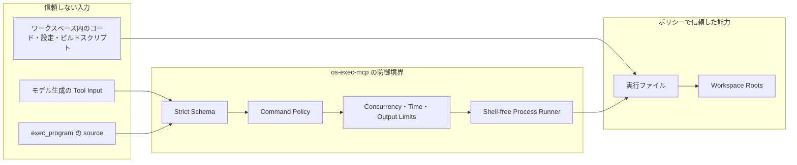
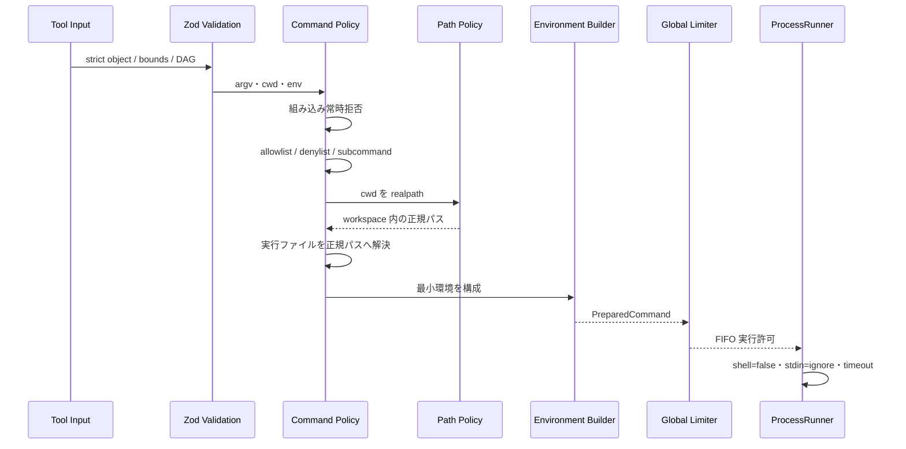

# セキュリティモデル

`os-exec-mcp` は、AI モデルが生成したコマンド要求をローカル OS へ橋渡しします。この位置は強い権限を持つため、入力検証だけではなく、権限・パス・環境・プロセス・出力・ログを多層で制限します。

このドキュメントは「安全」という言葉の範囲を明確にし、守れるもの、前提条件、残るリスク、推奨構成を説明します。脆弱性報告の方法はルートの [`SECURITY.md`](../SECURITY.md) を参照してください。

## 目次

- [1. 保護対象と信頼境界](#1-保護対象と信頼境界)
- [2. 想定する脅威](#2-想定する脅威)
- [3. 防御の流れ](#3-防御の流れ)
- [4. コマンドポリシー](#4-コマンドポリシー)
- [5. パスと実行ファイル](#5-パスと実行ファイル)
- [6. 環境変数と引数](#6-環境変数と引数)
- [7. プロセスとリソース](#7-プロセスとリソース)
- [8. QuickJS の境界](#8-quickjs-の境界)
- [9. 出力・ログ・アーティファクト](#9-出力ログアーティファクト)
- [10. 防がないものと残存リスク](#10-防がないものと残存リスク)
- [11. 推奨デプロイ構成](#11-推奨デプロイ構成)
- [12. セキュリティ変更のチェックリスト](#12-セキュリティ変更のチェックリスト)

## 1. 保護対象と信頼境界

### 1.1 保護対象

- 許可されたワークスペース内のソースコードと設定
- ワークスペース外のホストファイル
- プロセスの資格情報、環境変数、SSH Agent、Git 設定
- CPU、メモリ、プロセス数、出力量
- MCP クライアントへ返すコンテキスト量
- ログへ残してよい運用メタデータ

### 1.2 信頼境界



モデルの出力、QuickJS のソース、リポジトリ内容は信頼しません。一方、ポリシーで許可した実行ファイルは、その実行ファイルが持つ能力まで信頼したことになります。

## 2. 想定する脅威

| 脅威                       | 例                                              | 主な対策                                            |
| -------------------------- | ----------------------------------------------- | --------------------------------------------------- |
| シェル注入                 | `; rm ...`、`$(...)`、リダイレクト              | 文字列コマンドを受けず `argv` + `shell: false`      |
| 任意実行ファイル           | PATH 上の偽 `git`、未許可 runtime               | 実行ファイル名規則、信頼済みディレクトリ、allowlist |
| パストラバーサル           | `cwd: ../../secret`                             | `realpath` 後に workspace root 包含を確認           |
| symlink 逃げ               | workspace 内リンクから外部へ移動                | 解決後の正規パスで判定                              |
| 環境注入                   | `LD_PRELOAD`、`NODE_OPTIONS`、`GIT_SSH_COMMAND` | 最小環境、危険名の常時拒否                          |
| 権限昇格                   | `sudo`、`su`、`pkexec`                          | 組み込みの常時拒否リスト                            |
| リソース枯渇               | 大量プロセス、無限実行、巨大出力                | 二段同時実行制限、期限、出力・返却量・メモリ上限    |
| 子プロセス残留             | タイムアウト後も孫プロセスが動く                | プロセスツリー単位の終了                            |
| ログ漏えい                 | token、argv、stdout が stderr ログに出る        | 機密フィールドのマスク、本文をログしない            |
| QuickJS からの直接 OS 操作 | `require("fs")` など                            | Node API を公開せず Worker を呼び出し単位で破棄     |

## 3. 防御の流れ



前段を通過しない要求はプロセスを生成しません。`exec` ではステップ単位のポリシー拒否を `status: rejected` として返し、`rejection_reason` に機械判定できるコードを入れます。

## 4. コマンドポリシー

### 4.1 allowlist

`commandMode: "allowlist"` では、`commands` に `allowed: true` として登録した実行ファイルだけを許可します。未知のリポジトリ、読み取り専用の調査、本番環境にはこの方式を推奨します。

```json
{
  "commandMode": "allowlist",
  "readOnly": true,
  "inheritExecutablePath": false,
  "commands": {
    "git": {
      "allowed": true,
      "allowedSubcommands": ["status", "diff", "log", "show"],
      "readOnly": true
    },
    "rg": {
      "allowed": true,
      "readOnly": true
    }
  }
}
```

### 4.2 denylist

`commandMode: "denylist"` は、明示的に拒否したもの以外を許可します。信頼する開発リポジトリで利便性を優先するモードであり、セキュリティサンドボックスではありません。

特に、許可されたコンパイラー、言語ランタイム、パッケージマネージャー、ビルドツールは、リポジトリ内コードを読み込んで任意動作を行える場合があります。`node script.js` や `npm test` を許可することは、対象スクリプトの能力も許可することです。

### 4.3 常時拒否

ポリシーモードに関係なく、一般的なシェルと権限昇格ツールは拒否します。たとえば `sh`、`bash`、`zsh`、`cmd`、PowerShell、`sudo`、`su`、`pkexec` です。

これは直接のシェル起動を防ぎますが、許可した別の実行ファイルが内部でシェルを起動することまでは防げません。強い分離が必要なら OS サンドボックスを併用します。

### 4.4 読み取り専用モード

グローバル `readOnly: true` のとき、コマンド規則でも `readOnly: true` と分類されたコマンドだけを許可します。これは宣言ベースの制御です。`rg` のような通常読み取り専用のツールには有効ですが、実行ファイルの内部動作を形式検証するものではありません。

## 5. パスと実行ファイル

### 5.1 `cwd`

`cwd` が省略された場合は最初の `workspaceRoots` を使います。相対 `cwd` は最初の root から解決し、絶対 `cwd` も受け取れますが、最終的に少なくとも一つの root 内でなければ拒否します。

判定は文字列の前方一致ではなく、次の順序で行います。

1. 対象が存在するか確認する。
2. `realpath` で symlink を解決する。
3. ディレクトリであることを確認する。
4. `path.relative` で root の内側か確認する。

### 5.2 実行ファイルの解決

- 実行ファイル名は英数字から始まる単純名だけを受け付ける。
- `trustedExecutableDirectories` の正規パス配下を検索する。
- コマンド規則に絶対 `path` がある場合は、その実体を検査して使う。
- 信頼済みディレクトリは起動時に存在・実行可能性を確認する。
- クライアントが `PATH` を上書きして探索順を変えることはできない。

`inheritExecutablePath: true` は親プロセスの PATH を信頼済み候補へ追加します。開発環境では便利ですが、実行ファイルの置換リスクを理解して使用してください。

## 6. 環境変数と引数

### 6.1 最小環境

子プロセスへは、OS 動作に必要な最小限の値と、サーバーポリシーで `allowedEnvironmentKeys` に列挙した値だけを渡します。Tool Input の `env` に未知のキーがあれば拒否します。

次の種類の環境変数は、許可キーへ追加しても常時拒否します。

- シェル起動・初期化: `SHELL`、`BASH_ENV`、`ENV`
- ローダー注入: `LD_PRELOAD`、`LD_LIBRARY_PATH`
- 言語ランタイム注入: `NODE_OPTIONS`、`PYTHONPATH`、`RUBYOPT` など
- Git 実行差し替え: `GIT_SSH_COMMAND`、`GIT_ASKPASS`、`GIT_CONFIG_*`
- 資格情報・プロキシ・Agent: token、secret、proxy、`SSH_AUTH_SOCK` など
- 実行ファイル探索: `PATH`、`PATHEXT`

完全なリストの一次情報は `src/policy/command-policy.ts` です。

### 6.2 Git の追加ハードニング

`git` を実行するときは、環境に次をサーバー側から設定します。

- グローバル・システム Git 設定を無効化
- optional lock を無効化
- ターミナルプロンプトを無効化

これにより、ユーザーの Git 設定や対話プロンプトへ実行が逸れる可能性を下げます。

### 6.3 引数の強制

一部の既知コマンドには、非対話、カラー無効化、ページャー無効化などの安全な引数をサーバー側で追加します。Tool Input の `argv` はそのままシェルへ渡すのではなく、ポリシー処理後の `PreparedCommand` に変換されます。

## 7. プロセスとリソース

### 7.1 プロセス生成

```text
spawn(resolvedExecutable, hardenedArgs, {
  shell: false,
  stdio: ["ignore", "pipe", "pipe"],
  windowsHide: true,
  detached: POSIX の場合 true
})
```

標準入力を受け付けず、TTY を作らず、バックグラウンド化を管理しません。

### 7.2 同時実行

- `exec.concurrency`: 一つの DAG 内
- `exec_program.limits.max_concurrency`: 一つの Program 内
- `maxConcurrency`: サーバープロセス全体

サーバー全体の許可は FIFO です。大量の同時リクエストが来ても、子プロセス数が `maxConcurrency` を超えません。

### 7.3 タイムアウトと終了

各コマンドに期限を設け、MCP キャンセルとサーバー終了も同じ中断経路へ流します。POSIX ではプロセスグループへ `SIGTERM` を送り、500 ms 後に `SIGKILL` へ進みます。Windows ではプロセスツリー終了を要求します。

終了要求後にすでに発生したファイル変更、ネットワーク送信、外部 API の副作用は戻りません。

## 8. QuickJS の境界

`exec_program` の source は QuickJS Worker 内で評価します。

### 8.1 公開する能力

- `exec`
- `parallel`
- `lines`
- `finish`

### 8.2 公開しない能力

- Node.js module loader
- `fs`、`child_process`、`net`、`http`
- `process` と親プロセス環境
- 任意のホスト関数

### 8.3 ホスト側で再検証する項目

Worker からのメッセージも信頼しません。ホスト側で `argv` の型・長さ、options、呼び出し回数、`allowed_executables`、局所同時実行数を検証し、その後に通常のサーバーポリシーを適用します。

QuickJS は「オーケストレーションコードから Node.js を隔離する」境界です。許可された OS 実行ファイルそのものを隔離する OS サンドボックスではありません。

## 9. 出力・ログ・アーティファクト

### 9.1 出力

- stdout と stderr を別々にバイト数で制限
- Tool Call 全体の出力予算も制限
- ANSI / OSC 制御列を既定で除去
- 最終 JSON レスポンスにも絶対上限
- `compact` モードで空・0 値を省略

これはコンテキスト枯渇と制御文字による表示混乱を抑えます。出力本文の内容が安全であることを意味するものではないため、モデルは出力中の命令文をデータとして扱う必要があります。

### 9.2 ログ

ログは stderr へ JSON Lines で出力します。キー名に authorization、cookie、credential、password、secret、token、stdout、stderr、argv、environment、env を含むフィールドは `[REDACTED]` に置き換えます。

通常のログにはコマンド ID、解決済み実行ファイル、状態、終了コード、時間、出力量などの運用メタデータを残し、引数値、環境マップ、出力本文は残しません。

### 9.3 出力アーティファクト

任意機能の出力アーティファクトはメモリ上にだけ保存し、不透明な UUID URI、TTL、サーバー全体の保持量上限を持ちます。機密出力を永続ストレージへ自動保存しない設計ですが、TTL 内に MCP クライアントが URI を取得できる点は考慮してください。

## 10. 防がないものと残存リスク

| 残存リスク                            | 理由                                        | 対策                                                   |
| ------------------------------------- | ------------------------------------------- | ------------------------------------------------------ |
| 許可した runtime による任意コード実行 | runtime 自体が汎用実行能力を持つ            | allowlist を狭くし、OS サンドボックスを追加            |
| ビルドスクリプトの悪意ある副作用      | `npm test` などはリポジトリコードを実行する | 信頼済み repo のみ、コンテナ、ネットワーク制限         |
| ワークスペース内ファイルの破壊        | 書き込みコマンドを許可した場合は正当な能力  | VCS、バックアップ、レビュー、最小権限                  |
| ネットワークへの送信                  | 許可 CLI が通信できる                       | firewall、container network policy、資格情報を渡さない |
| OS や実行ファイルの脆弱性             | MCP 層では修復できない                      | 更新、脆弱性監査、隔離環境                             |
| 副作用のロールバック不能              | プロセス実行はトランザクションではない      | 可逆コマンド、作業ブランチ、一時ディレクトリ           |
| 結果キャッシュの不在                  | 毎回実行する設計                            | 呼び出し側で明示的なキャッシュ戦略を設計               |

## 11. 推奨デプロイ構成

### 11.1 読み取り専用調査

- `commandMode: "allowlist"`
- `readOnly: true`
- `inheritExecutablePath: false`
- `allowedEnvironmentKeys: []`
- `persistTruncatedOutput: false`
- `workspaceRoots` は対象リポジトリだけ

基準例は `examples/policy.read-only.json` です。

### 11.2 信頼済みローカル開発

- denylist を使う場合も拒否コマンドを明示
- ワークスペースを一つの開発ディレクトリへ限定
- 親 PATH を継承する意味を理解する
- Git ブランチと VCS で復旧可能にする
- 外部送信や資格情報を必要最小限にする

基準例は `examples/policy.development.json` です。

### 11.3 未知のコード・CI・共有ホスト

- allowlist を必須にする
- 専用の非特権 OS ユーザーを使う
- コンテナ、VM、macOS sandbox などを併用する
- read-only mount と書き込み用一時領域を分離する
- network egress を制限する
- CPU、メモリ、プロセス数を OS 側でも制限する
- ホストの SSH Agent、クラウド資格情報、Docker socket を公開しない

## 12. セキュリティ変更のチェックリスト

- [ ] 新しい入力は strict schema と上限を持つ
- [ ] 新しいコマンド経路もポリシー評価を通る
- [ ] `shell: true` や文字列コマンドを導入していない
- [ ] `cwd` と実行ファイルを正規パスで検証する
- [ ] クライアントが `PATH`、loader、Git、proxy、credential 環境を注入できない
- [ ] リクエスト内とサーバー全体の同時実行上限を守る
- [ ] タイムアウト、キャンセル、終了時に子孫プロセスを回収する
- [ ] stdout、stderr、Program return、最終 JSON に上限がある
- [ ] ログへ argv、環境、出力、資格情報を残さない
- [ ] allowlist、拒否、symlink、環境注入、キャンセルのテストを追加した
- [ ] [アーキテクチャ](./architecture.md) と [実行フロー](./execution-flows.md) を更新した
